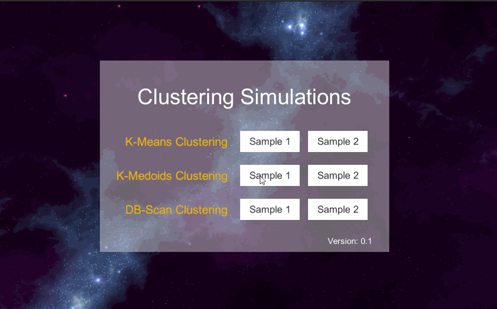
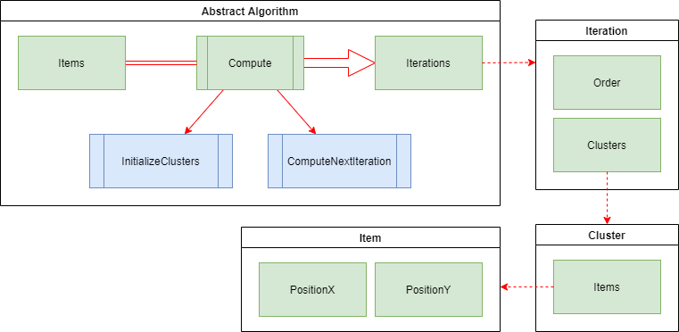

# Simple Clustering Simulations 

This project provides the implementation of three clustering algorithms in Unity3d.

` IMPORTANT: The code is not optimized for handling large number of items. Instead, it was optimized for simulation purposes by storing all the iterations and their respective data. `

| K-Means | K-Medoids | DB-Scan |
| :-----: | :-------: | :-----: |
|  |    |  |
| [wikipedia](https://en.wikipedia.org/wiki/K-means_clustering) | [wikipedia](https://en.wikipedia.org/wiki/K-medoids)   | [wikipedia](https://en.wikipedia.org/wiki/DBSCAN) |

# Demo



We created a demo that simulates and visualizes the three algorithms with two predefined samples.
A complete demo can be found on [https://omaddam.github.io/Simple-Clustering-Simulations/](https://omaddam.github.io/Simple-Clustering-Simulations/).

# Getting Started

These instructions will get you a copy of the project on your local machine for development and testing purposes.

### Prerequisites

The things you need to install before you proceed with development:

1) [Unity3d (2020.2.0f1)](https://unity3d.com/get-unity/download/archive) [required].

### Installing

A step by step guide to get you started with development.

#### Download, clone, and setup the repository

```git
git clone https://github.com/omaddam/Simple-Clustering-Simulations.git
```

#### Initialize git flow

```git
git flow init
```

# Standards

### General Standards

* Line ending: CRLF
* Case styles: Camel, Pascal, and Snake case
  * Arguments, paramters, and local variables: camel case (e.g. iterationOrder)
  * Global variables: pascal case (e.g. SeedItems)
  * Constants and static variables: snake case (ALL CAPS) (e.g. ALGORITHM_NAME)
* Methods naming convention:
  * Pascal case (e.g. GenerateSample)
  * Verbs

### Commenting Standards

* `///` Summaries: Full-usage of English grammar and punctuation. (e.g. Add periods to the end of your summaries, as if you were writing a phrase or sentence.)
*  `//` In-line comments: quick, point-form. Grammar and punctuation not needed

### Third Party Packages

* All packages should be included under Assets/ThirdParty folder.
* Contains all packages downloaded from the Unity3d store.

### Assets / App

* Contains scripts, scenes, and all resources used to create the demo application.
* Scripts are created under Assets/App/Scripts folder.

### Assets / Others

* All components should be included under Assets/\<Name> folder. (e.g. Assets/Grid)
* Each component should be isolated and under **NO CIRCUMSTANCES** referencing or using another component's scripts.
* Components are **NOT** allowed to reference or call application scripts.
* Components are allowed to reference and use ThirdParty scripts.

# Code Based Documentation

## Assets / Clustering

This folder contains all the scripts of the clustering component. The core scripts are in the *Core* folder while the rest of the scripts are in their proper implementation folders.

### Core

The core contains 4 classes as shown in the figure below.



* **AbstractAlgorithm** is an abstract class that defines the flow of all the implemented algorithms.
  * Properties
    * **Items**: list of all items that are to be clustered.
    * **Iterations**: list of all computed iterations. Gets populated upon calling the *Compute* method.
  * Methods
    * **Compute**: a public method that uses the two other methods to generate the iterations.
    * **InitializeClusters**: an abstract method that gets implemented by the different clustering algorithms. This method is used to initialize the first set of clusters used in the first iteration.
    * **ComputeNextIteration**: an abstract method that gets implemented by the different clustering algorithms. Tries to compute the next iteration. If there are no changes to the clusters, the method will return null, identifying the end.

* **Iteration**: represents a single state in an algorithm. It stores all the clusters with their items at a specific snapshot.

* **Cluster**: represents a list of items grouped by their similarities. In the case of this implementation, they are grouped by their physical location's cohesion.
  
* **Item**: represents a single point in a 2D graph.

### KMeans

### KMedoids

### DBScan

## Assets / Grid

## Assets / App